# Lab: Create a Group Policy Object (Password Policy)

This lab walks through creating a Group Policy Object (GPO) in Active Directory that enforces an organization's password policy — maximum password age, minimum password length, and password complexity requirements.

## Prerequisites

- A domain controller with Active Directory Domain Services and Group Policy Management installed
- Administrator access to Server Manager

## Steps

### 1. Open Group Policy Management

In Server Manager, click **Tools**, then select **Group Policy Management**.

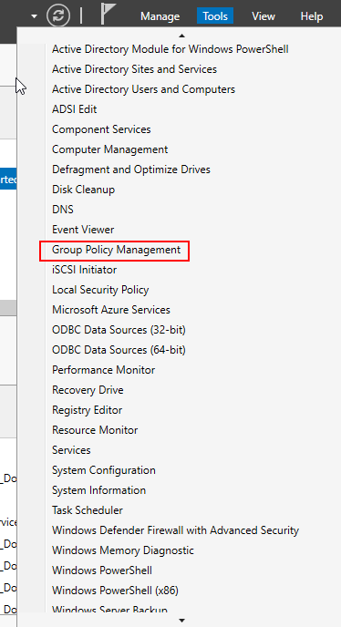

### 2. Expand your forest

Expand the folder corresponding to your Active Directory forest (in this lab, `lab.test`).

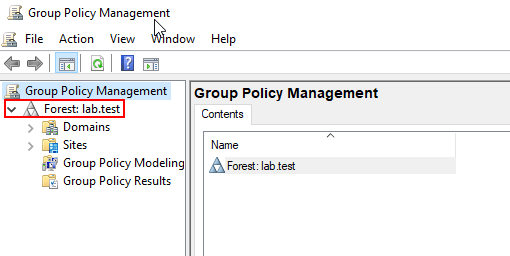

### 3. Expand the Domains folder

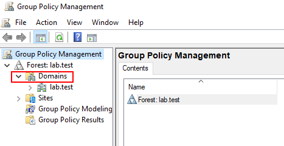

### 4. Expand your domain

Expand the folder corresponding to your domain (`lab.test`).

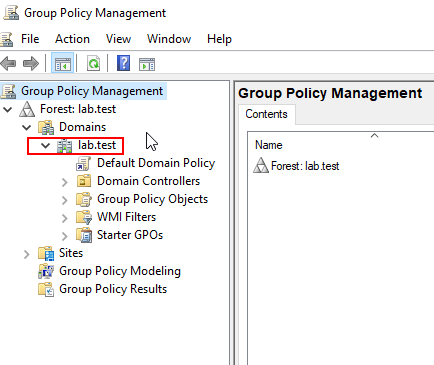

### 5. Create a new GPO

Right-click the **Group Policy Objects** folder and select **New** from the pop-up menu.

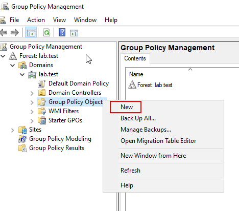

### 6. Name the GPO

Name the new GPO **Password Policy** and click **OK**.

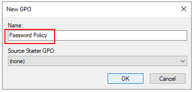

### 7. Edit the GPO

Click the **Group Policy Objects** folder, right-click the new **Password Policy** GPO, and select **Edit** from the pop-up menu.

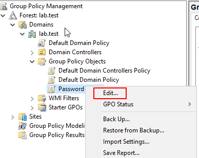

### 8. Navigate to Password Policy settings

Under **Computer Configuration**, expand **Policies**, then **Windows Settings**, then **Security Settings**, then click **Password Policy**.

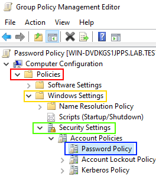

### 9. Set maximum password age

Double-click **Maximum password age**. In the pop-up window, select **Define this policy setting** and set the expiration value to **90 days**. Click **OK** to close the window.

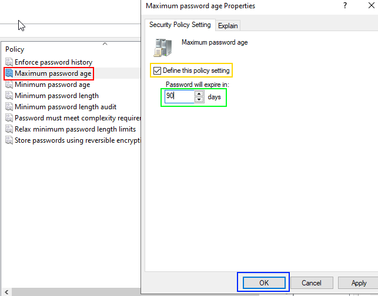

### 10. Accept the minimum password age change

Click **OK** to accept the suggested change to the minimum password age.

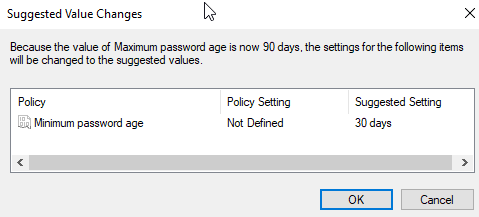

### 11. Set minimum password length

Double-click **Minimum password length**, select **Define this policy setting**, set the value to **12** under *Password must be at least*, then select **OK**.

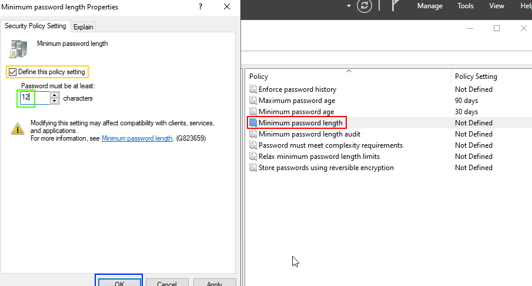

### 12. Enable password complexity requirements

Double-click **Password must meet complexity requirements**, checkmark **Define this policy setting**, select **Enabled**, then click **OK**.

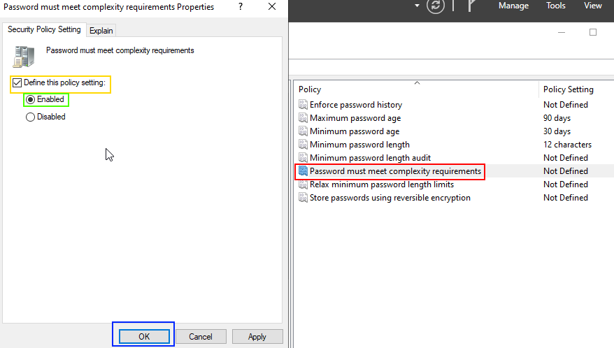

### 13. Confirm the policy

You have now successfully created a Group Policy Object that enforces the organization's password policy. You can apply this GPO to users and/or groups as needed.

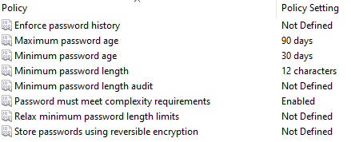

## Summary

The **Password Policy** GPO now enforces:

| Setting | Value |
|---|---|
| Maximum password age | 90 days |
| Minimum password length | 12 characters |
| Password complexity requirements | Enabled |
